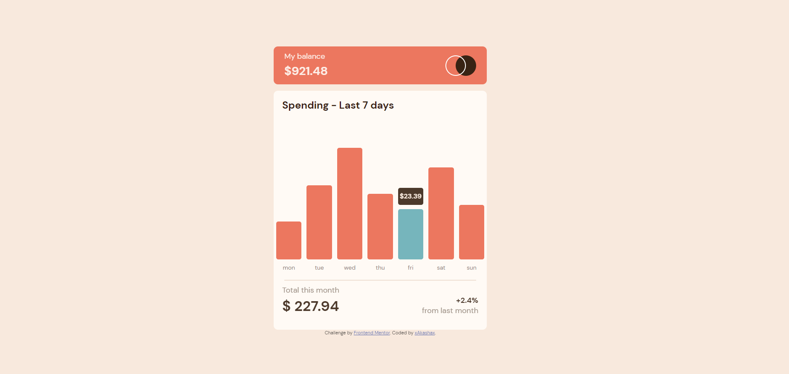
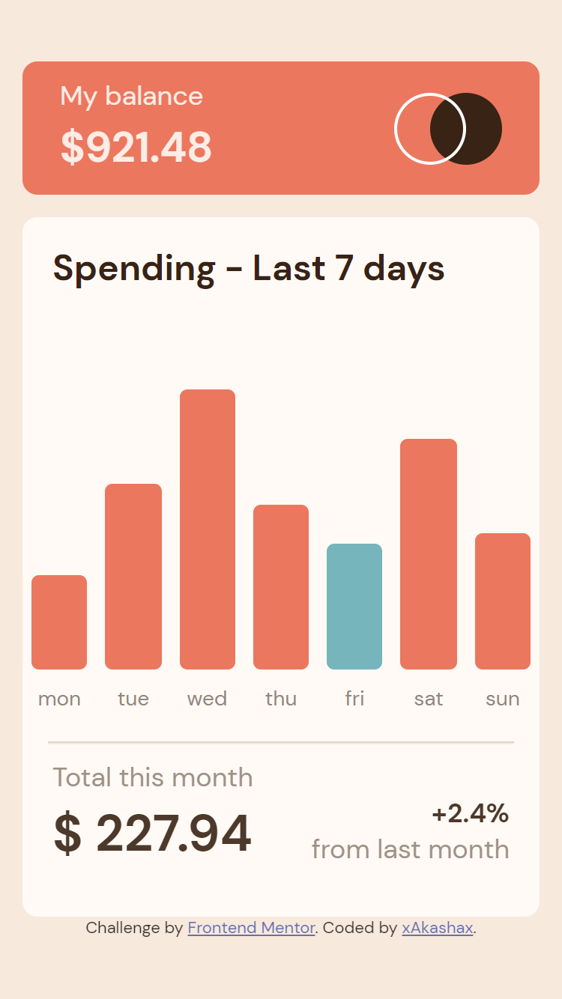

# Frontend Mentor - Expenses chart component solution

This is a solution to the [Expenses chart component challenge on Frontend Mentor](https://www.frontendmentor.io/challenges/expenses-chart-component-e7yJBUdjwt). 

This challenge took me a lot of time. I made it a little different. 
This project is not perfect. I didn't focus on the exact css copping. I did it interactive using the data from data.json.
This way, if something changes in the data, it gets changed and mapped to the chart.
I calculated the current amount for this month as a function and displayed it in the project.
You can see hover states for interactive elements on the page,  see the current day’s bar highlighted in a different colour to the other bars.
When you click on a bar, it will be highlighted and its label with the amount will be displayed.

## Table of contents

- [Overview](#overview)
  - [The challenge](#the-challenge)
  - [Screenshot](#screenshot)
  - [Links](#links)
- [My process](#my-process)
  - [Built with](#built-with)
- [Author](#author)

**Note: Delete this note and update the table of contents based on what sections you keep.**

## Overview

### The challenge

Users should be able to:

- View the bar chart and hover over the individual bars to see the correct amounts for each day
- See the current day’s bar highlighted in a different colour to the other bars
- View the optimal layout for the content depending on their device’s screen size
- See hover states for all interactive elements on the page
- **Bonus**: Use the JSON data file provided to dynamically size the bars on the chart

### Screenshot

### Links

- Solution URL: [Frontend Mentor](https://www.frontendmentor.io/solutions/expenses-chart-component-using-js-interactive-8RF9H1mnlO)
- Live Site URL: [Live Demo](https://enchanting-meerkat-d3dcee.netlify.app/)

## My process

### Built with

- Semantic HTML5 markup
- CSS custom properties
- Flexbox
- Mobile-first workflow
- JS

## Author

- Frontend Mentor - [@xAkashax](https://www.frontendmentor.io/profile/xAkashax)
